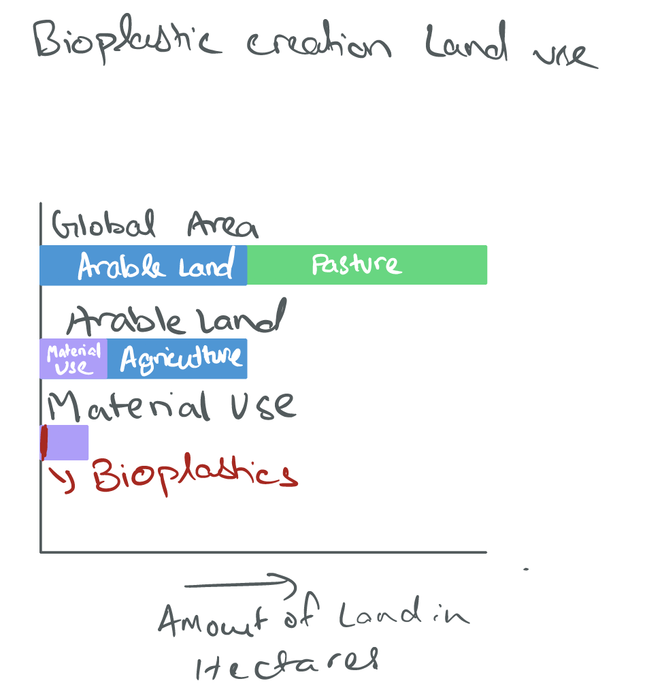

# portfolio
My portfolio page for Telling Stories with Data

# About me
I'm Shashank Bhoop (he/him/his) and I'm a student in the Information Systems program at Heinz and I'll be graduating this December.I like to think of myself as a tech guy who loves simplifying tech for the better. As business and technology don't exist without each other, I look to be the bridge that connects both, and that's what I've done as a business analyst professionaly and what I've learned more about at Carnegie Mellon University. Having used a variety of tools and languages for visualizing data, I believe there is no one super tool and no tool is less (yes, I love Excel). 

To be adept at realizing what tool is best for a task is my aim and to implement a basic ideology of best design practices across my work is my aim, in whatever I do. Once I graduate, I look to make an impact at an organization where I can use these skills. I also love adventure, so here is a picture of me paragliding!

## What I hope to learn
I hope to learn how to get the most information across to the most amount of people in the most efficient manner possible. Confusing charts and graphs have always made lots of information inaccessible to most, and in turn are often misinterpreted. A picture can tell a thousand words but a well thought graph can tell much more. In this busy world I want to be able to communicate my results, research and findings as quickly as possible to get my point across while providing all the information needed. Data always tells a story, and I want to be its illustrator.

# Portfolio

## Assignment 2
### General Government Debt
<iframe src="https://data.oecd.org/chart/69Hy" width="860" height="645" style="border: 0" mozallowfullscreen="true" webkitallowfullscreen="true" allowfullscreen="true"><a href="https://data.oecd.org/chart/69Hy" target="_blank">OECD Chart: General government debt, Total, % of GDP, Annual, 2017</a></iframe>

### General Government Debt (Grid-Line Chart)

In the following grid you can see the visualization of Debt to GDP Ratio for each country over the years. The line is used to denote the trend.

### General Government Debt (Grid-Scatter Plot)

In the following grid you can see the visualization of Debt to GDP Ratio for each year, with X axis being the country and y axis being the Debt to GDP Ratio. This will help us identify the outliers for any years, as well as see what kind of grouping trends are visible.

In the first visualization, we have identified the trend for each country over the years, this will help us in future projections or to see how the country has fared over the years. The problem with this is that it doesn't directly compare to the other countries, and we can not see how each country fares to the others over the years. For that purpose I decided to switch the grid-facet from Country to year, so that we can see the trends and groupings among countries each year. This also helps us see outliers for a year, which can be further explored.

## Assignment 4

Data source used:
https://www.foodnavigator.com/Article/2013/04/08/European-Bioplastics-data-on-land-use-for-production#

The reason I used this data source was because it was sort of relative to my project, and I felt it was a bit misleading in terms of prediction (hence why I removed the prediction). It is also interesting because the data point of note is very miniscule in comparison to the rest of the data and I felt it would be interesting to cisualize just the massive difference in size of data points. 

### Methodology

The first thing I felt while looking at this visualization was that it was a bit complicated and garish to look at due to the colors. I also saw the scope for simplifying it to remove confusion by taking out the visuals. While doing the critique exercise, I realised something important, that a consistent measure wasn't used across data subsections. The 1st subsection had a a pie chart of it own and the second part had the pie chart broken down further with similar colors all bunched up. Hence why I felt like a redesign was needed. 

