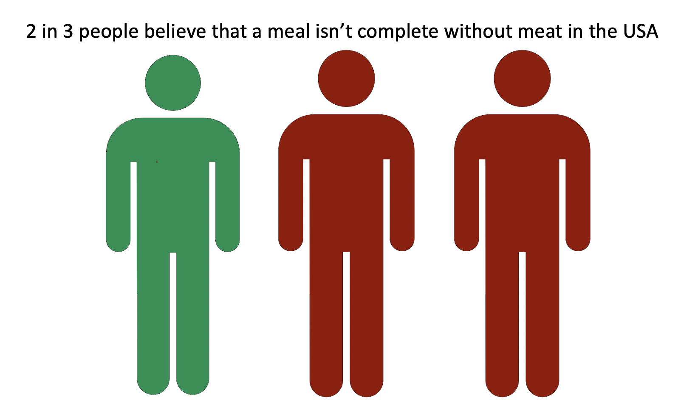
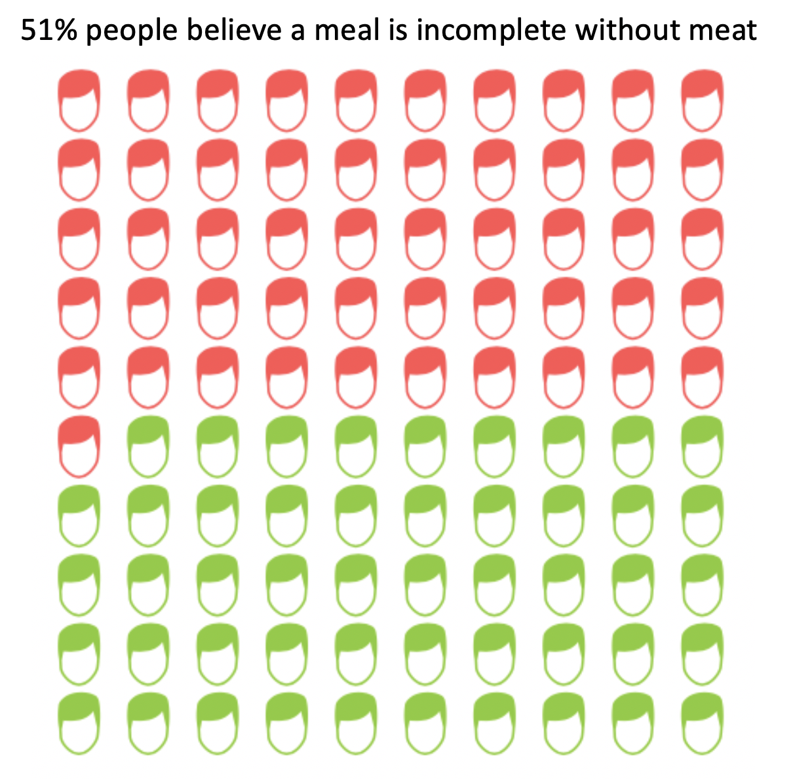
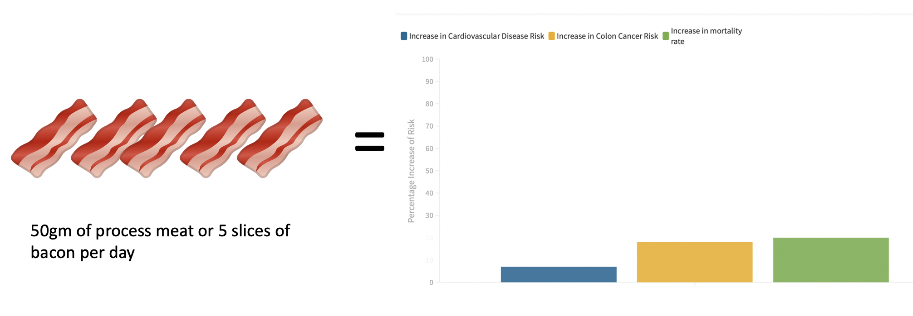
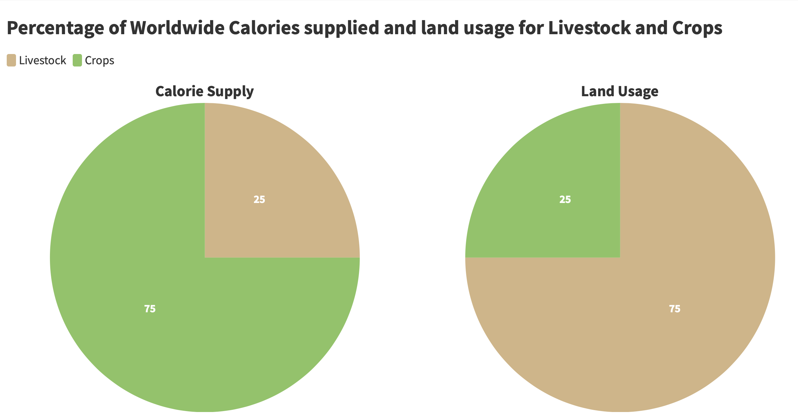
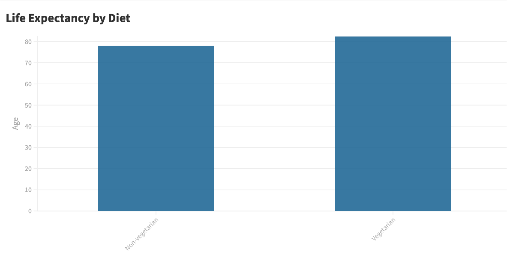
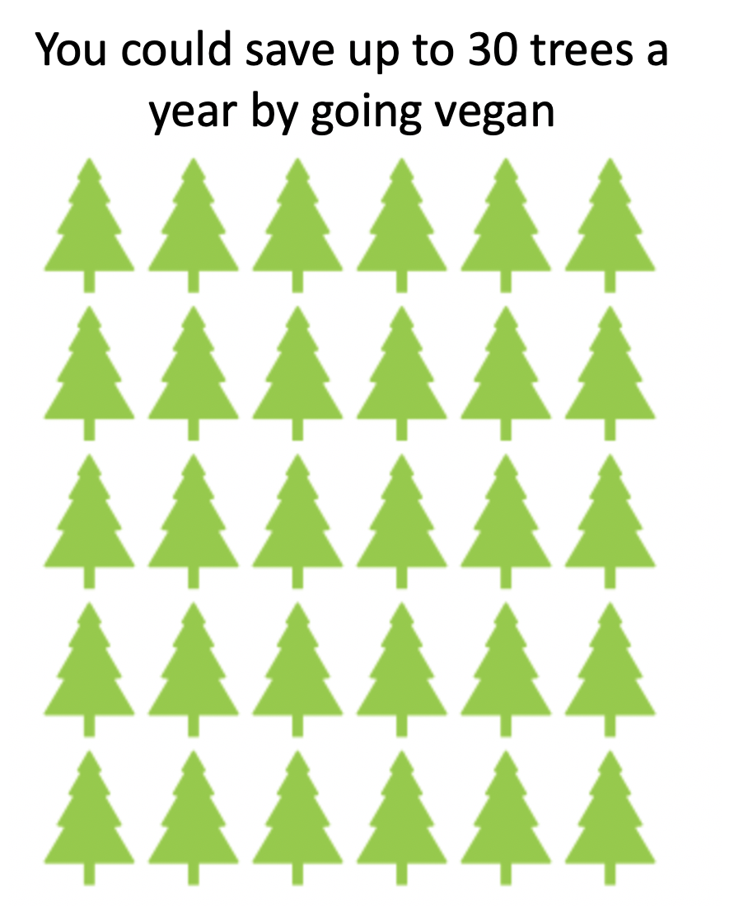

## Outline

My project aims to dispell the myths that a vegan/vegetarian diet doesn't provide more than enough nutrients to lead a healthy life, while at the same time stressing on the ecological benefits of a vegan/vegetarian diet.

The flow will be of this sort.

## Initial Sketches
A few initial sketches I have will focus on the drawbacks of eating meat, both for us and the environment as well as the benefits from veganism.

## Data

As it is a bit difficult to find granular data from studies conducted, I'll be aiming to use multiple scientific studies and their results to go through my agenda. These sources include but are not limited to the following links.

https://www.nature.com/articles/s41598-020-63910-y#data-availability
https://www.healthline.com/nutrition/vegan-diet-studies#TOC_TITLE_HDR_2
https://serc.berkeley.edu/the-vegan-and-vegetarian-protein-myth-debunked/
https://www.futurekind.com/blogs/vegan/17-environmental-benefits-of-veganism
 
Many of these sources themselves reference scientific papers from which I will be vetting for authenticity. The various statstics and comparisons can be compared using a variety of visualization methods.

## Method and Medium

My plan is to use shorthand to walk the user through a story of how we came to be so meat-dependent, then continue to move on to the negative impact of eating meat on us. Then to furhter exacerbate the situation I will show them the environmental impact it has. Then as the user goes on, they will be shown that there is a ray of hope for them, and that all is not lost.

Veganism can reverse the effects on our bodies and the environment. To get our users to take action, I will call them to try a vegan diet for a week to experience the difference themselves. I will also suggest them recipes, videos as well as meal planning services if possible to get them over the edge, based on their time, inteerest and ability to cook.

# Part2

My project aims to flow by first understanding the nature of meat eating habits and expectations throught the first two visualizations.

Then I want to show the harmful impact on the body of these habits

Following it up with the impact of meat eating on the environment

Then I'd like to outline the benefits of going vegetarian on both our bodies and the environemnt.

## User Research

Target Audience: 
Young adults between the ages of 20 and 30, who currently eat meat as a part of their diet.

My approach to identifying people to interview:

I wanted to show my work to people who have been long term meat eaters, and who I think include meat in almost every meal. I also wanted to make sure these people are making these choices of their free will and not because of financial restrictions, so I made sure these people were well off or earning. I also decided this age group as I resonate with it and I believe these people are more open to change than older individuals and also have the power to make changes that younger individuals may not have.

### My Interview Script:

Did you feel the visualizations were effective in conveying the impacts of eating meat?

Which visualization do you think was the most impactful?

Which visualization do you think was the least impactful?

Is the choice of colors appropriate throughout?

Does the flow of events seem appropriate? Did you feel something was out of place?

Would you be interested in trying a meat free / less meat diet, even for a short period of time?

 #### Subject 1: 25y male, graduating master’s student, regularly goes to the gym.

Did you feel the visualizations were effective in conveying the impacts of eating meat?
Some of them yes, some of them no

Which visualization do you think was the most impactful?
After looking at the life expectancy chart, I was most taken aback by the fact that there was a big difference in the numbers

Which visualization do you think was the least impactful?
The one that showed bacon and increase in risks of diseases. It was too small and the bars didn’t have any reference point.

Is the choice of colors appropriate throughout?
Yes, the colors do flow with the idea that green is for vegetarian diets and red is for meat. I don’t get the use of colors in the risks of diseases.

Does the flow of events seem appropriate? Did you feel something was out of place?
I liked how the visuals first highlighted the bad parts of eating meat and how the vegetarian diet helps me and the environment as well

Would you be interested in trying a meat free / less meat diet, even for a short period of time?

No, I go to the gym regularly and need to maintain my protein intake, which I don’t think I can get without chicken and beef. If I can get the protein from a plant-based diet I may consider.

#### Subject 2: 28y male, working professional, sedentary lifestyle.

Did you feel the visualizations were effective in conveying the impacts of eating meat?
Not really, I know the risks of eating meat on my body and I’m okay with them because I don’t think they are too much. I would like to know more about the impact on the environment and sustainability.

Which visualization do you think was the most impactful?
I liked how you could quantify how many trees I can save by going vegan. It puts things into perspective

Which visualization do you think was the least impactful?
The one which compared bacon to risk. It just didn’t make sense to me.

Is the choice of colors appropriate throughout?
I guess so. The bacon chart made no sense colorwise, but the rest of it doesn’t require too much effort to understand what’s vegetarian and what’s not.

Does the flow of events seem appropriate? Did you feel something was out of place?
I thought there might be more side by side comparisons of the effects of a meat free diet. Maybe if I see them head to head, I would consider it.

Would you be interested in trying a meat free / less meat diet, even for a short period of time?
Maybe, just to see if it really works. I wish I knew more about the short term effects so I could measure them.

#### Subject 3: 26y female, working professional, active lifestyle.

Did you feel the visualizations were effective in conveying the impacts of eating meat?
A little, I do feel compelled to understand more about how much land Is used for livestock

Which visualization do you think was the most impactful?
The one the compares the land usage for crops and livestock. I think that’s a real eye opener.

Which visualization do you think was the least impactful?
Strips of bacon which equate to increase in cancer risk? It took me to long to understand what was going on and what the bars were colored for.

Is the choice of colors appropriate throughout?
Yes, I think so, although the colors are consistent, the shades are a bit off on the first image and the pie chart for land usage.

Does the flow of events seem appropriate? Did you feel something was out of place?
I think the flow was good. Maybe you could use a stronger finishing to convince the reader.

Would you be interested in trying a meat free / less meat diet, even for a short period of time?
Yes, after learning of the effect on the environment, I think I’d like to try the diet.

### Research Findings

I can sum up my results as follows.

1. The bacon image doesn't seem to make much sense to people with the bars. The colors don't mean much either.
2. People want more information on the head to head comparison of nutritional info.
3. Color needs to be mroe consistent across images.

### What I plan to change and how

The first thing I need to do is introduce a baseline for the risks associated with eating meat. Then I would need to make sure I am using the same hex color codes for green and red throughout my images.
I will also find more statistics about the short term effects and compare them head to head.

## Part3

Through part 2, the first thing I realized was that I had to fix my approach to color. Haphazardly using different shades of red and green weren't giving a good look. To fix this I picked one shade of green and red from a color palette and used those hex codes throughout for red and green. This helped deliver my information faster as people were immediately able to follow the statistics related to vegans and non-vegans.
I also removed irrelevant color from  my graphs, adhering to the less is more principle.

To fix my problem of putting the risks of eating meat, I put in a baseline of the effects of drinking half a pint of beer everyday, something which people can easily imagine, and unfortunately, easily do as well. I also implemented some comparisons of protein in plant based and animal sources as well as a visualization of the land required for both for equal amounts of protein.

Earlier, I was also lacking a call to action, which I implemented, giving the user ideas for both cooking and ordering pre-made meals.

### Shorthand

Link to shorthand: https://carnegiemellon.shorthandstories.com/why-it-s-time-to-go-plant-based/index.html

### Data Sources:

https://www.mintel.com/press-centre/food-and-drink/taste-is-the-top-reason-us-consumers-eat-plant-based-proteins

https://ourworldindata.org/meat-production

https://www.health.harvard.edu/staying-healthy/red-and-processed-meats-raise-colorectal-cancer-risk

https://www.ncbi.nlm.nih.gov/pmc/articles/PMC3483430/

https://ourworldindata.org/agricultural-land-by-global-diets

https://ourworldindata.org/grapher/land-use-protein-poore

https://news.gallup.com/poll/282779/nearly-one-four-cut-back-eating-meat.aspx

https://www.ncbi.nlm.nih.gov/pmc/articles/PMC3701293/

https://www.myfooddata.com/articles/complete-vegetarian-protein-foods.php

https://preview.shorthand.com/0nWLH9lnwOJPAL5Z

