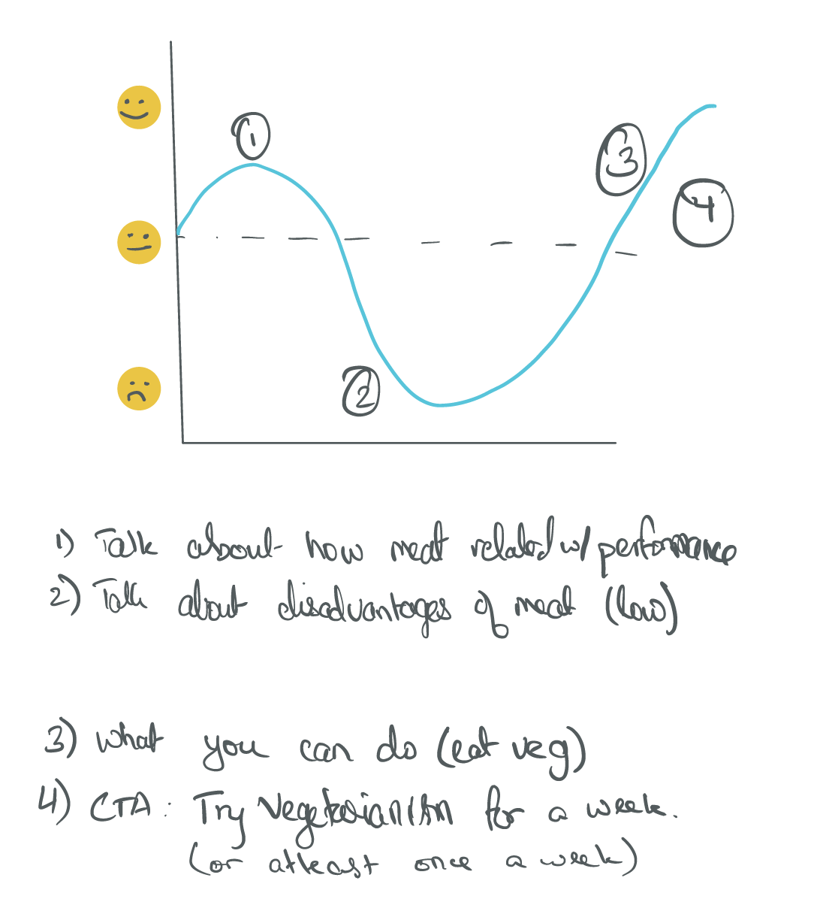
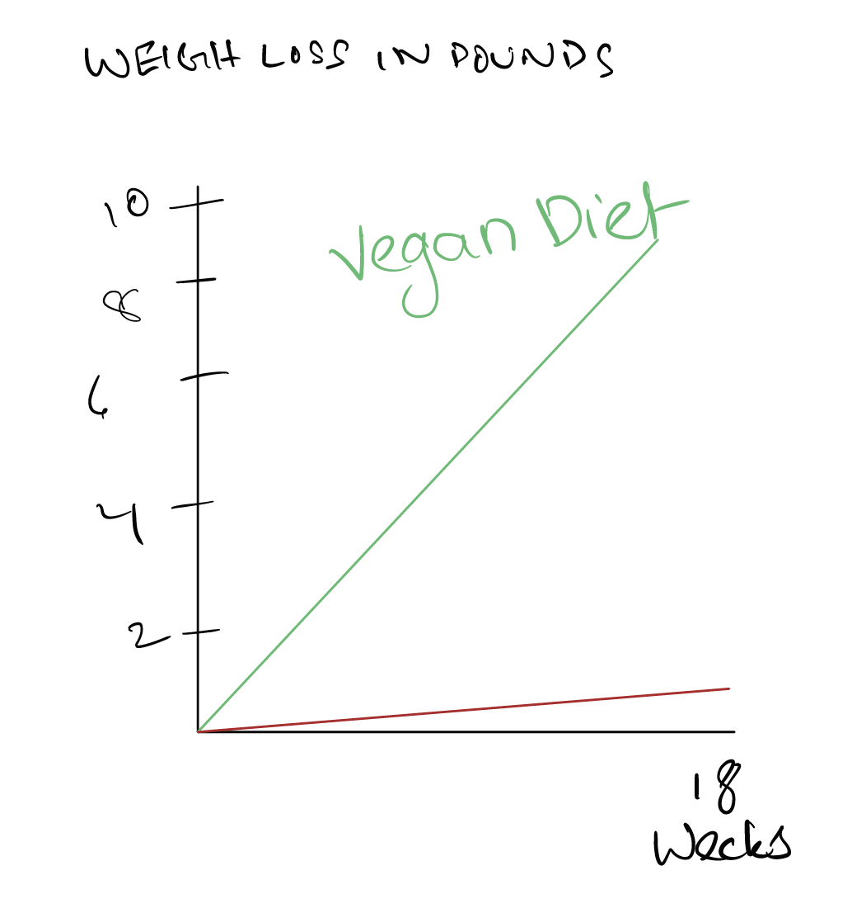

## Outline

My project aims to dispell the myths that a vegan/vegetarian diet doesn't provide more than enough nutrients to lead a healthy life, while at the same time stressing on the ecological benefits of a vegan/vegetarian diet.

The flow will be of this sort.

## Initial Sketches
A few initial sketches I have will focus on the drawbacks of eating meat, both for us and the environment as well as the benefits from veganism.

## Data

As it is a bit difficult to find granular data from studies conducted, I'll be aiming to use multiple scientific studies and their results to go through my agenda. These sources include but are not limited to the following links
https://www.nature.com/articles/s41598-020-63910-y#data-availability
https://www.healthline.com/nutrition/vegan-diet-studies#TOC_TITLE_HDR_2

