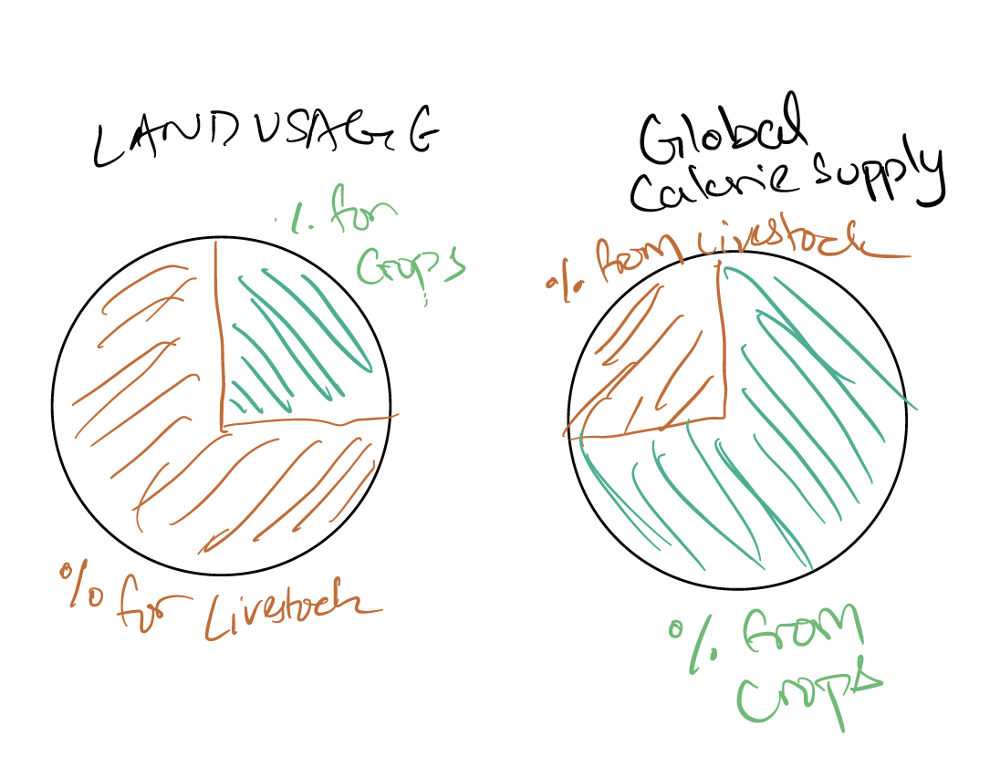

## Outline

My project aims to dispell the myths that a vegan/vegetarian diet doesn't provide more than enough nutrients to lead a healthy life, while at the same time stressing on the ecological benefits of a vegan/vegetarian diet.

The flow will be of this sort.

## Initial Sketches
A few initial sketches I have will focus on the drawbacks of eating meat, both for us and the environment as well as the benefits from veganism.

## Data

As it is a bit difficult to find granular data from studies conducted, I'll be aiming to use multiple scientific studies and their results to go through my agenda. These sources include but are not limited to the following links.

https://www.nature.com/articles/s41598-020-63910-y#data-availability
https://www.healthline.com/nutrition/vegan-diet-studies#TOC_TITLE_HDR_2
https://serc.berkeley.edu/the-vegan-and-vegetarian-protein-myth-debunked/
https://www.futurekind.com/blogs/vegan/17-environmental-benefits-of-veganism
 
Many of these sources themselves reference scientific papers from which I will be vetting for authenticity. The various statstics and comparisons can be compared using a variety of visualization methods.

## Method and Medium

My plan is to use shorthand to walk the user through a story of how we came to be so meat-dependent, then continue to move on to the negative impact of eating meat on us. Then to furhter exacerbate the situation I will show them the environmental impact it has. Then as the user goes on, they will be shown that there is a ray of hope for them, and that all is not lost.

Veganism can reverse the effects on our bodies and the environment. To get our users to take action, I will call them to try a vegan diet for a week to experience the difference themselves. I will also suggest them recipes, videos as well as meal planning services if possible to get them over the edge, based on their time, inteerest and ability to cook.

